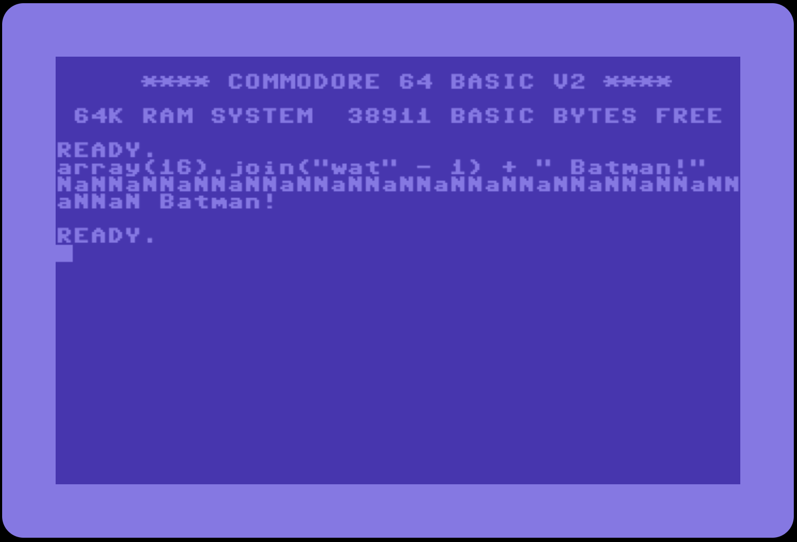

# retro-display

I had this great idea of a game where the user interface was an old-school
terminal. I wrote this code but I had no clue how the end-game would work. 
Mid-game was a problem too. Early-game needed improvment. 
Ideas never materialized. 

Don't let good code go to waste. I made some javascript consoles using 
the old-school displays. 

* [Commodore 64](https://blackchip-org.github.io/retro-display/c64/)
* [Commodore 128](https://blackchip-org.github.io/retro-display/c128/)
* [VIC-20](https://blackchip-org.github.io/retro-display/vic20/)
* [TI-99/4A](https://blackchip-org.github.io/retro-display/ti994a/)
* [VT-220](https://blackchip-org.github.io/retro-display/vt220/)
* [Ubuntu](https://blackchip-org.github.io/retro-display/ubuntu/)

## WAT?

# License 

MIT 

